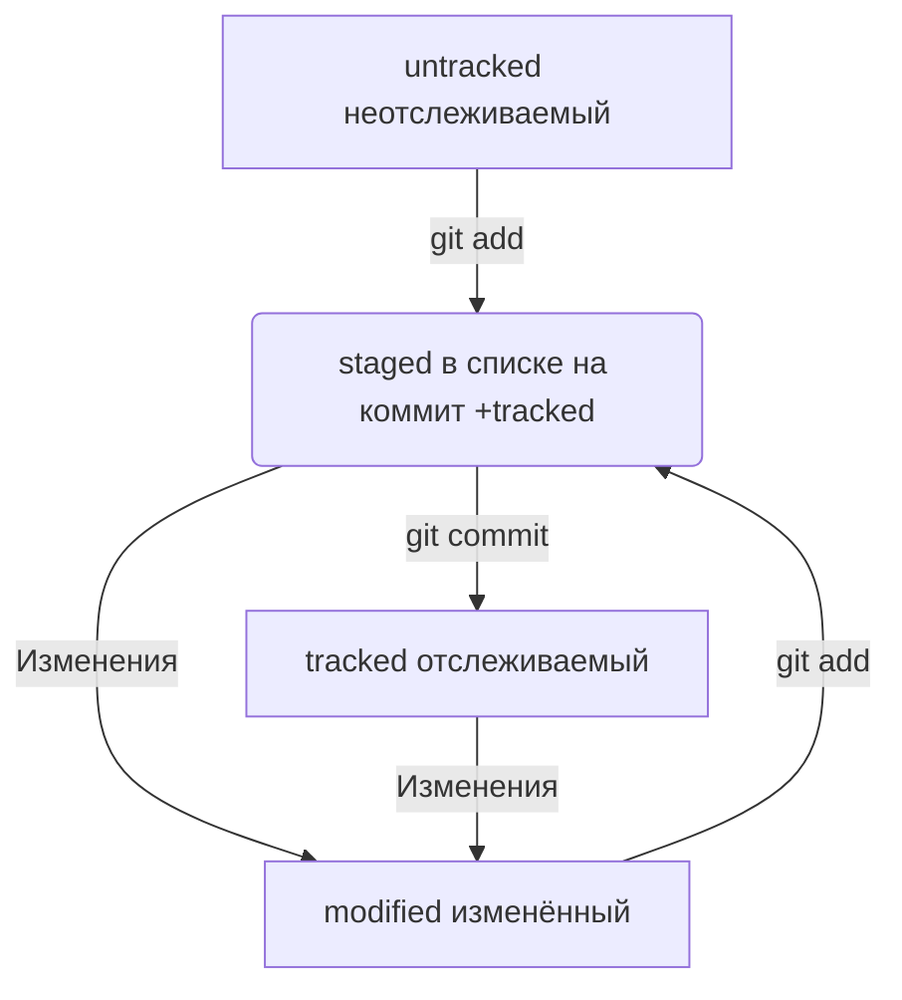

# Начало работы с Git (Windows)

## Создание репозитория и его инициализация

### Создать папку под будущий репозиторий

```
mkdir 
```

### Сделать папку репозиторием

```
git init
```

Чтобы Git начал отслеживать изменения в проекте, папку с файлами этого проекта нужно сделать Git-репозиторием (от англ. repository — «хранилище»). Для этого следует переместиться в неё и ввести команду git init (от англ. initialize — «инициализировать»).

Если вы случайно сделали Git-репозиторием не ту папку, её можно «разгитить». Для этого нужно удалить скрытую подпапку .git.

### «Разгитить» папку, если что-то пошло не так

```
rm -rf .git
```

Будьте осторожны: в подпапке .git хранится история изменений. Если удалить .git, то вся история проекта будет стёрта без возможности восстановления — останется только последняя версия файлов.

## Создание объектов для хранения в репозитории

### Проверить состояние репозитория 

```
git status
```
Команда git status выведет:
•	название текущей ветки: On branch master или On branch main;
•	сообщение о том, что в репозитории ещё нет коммитов: No commits yet;
•	сообщение, которое говорит: «чтобы что-нибудь закоммитить (то есть зафиксировать), нужно сначала это создать» — nothing to commit (create/copy files and use "git add" to track).

### Подготовить файлы к сохранению

```
git add
```
Добавим в репозиторий два файла. Например, файл todo.txt, в котором будет список дел, и readme.txt для информации о проекте.
Создайте файлы todo.txt и readme.txt в папке first-project и запустите git status, чтобы посмотреть, что изменилось.
```
$ touch todo.txt
$ touch readme.txt
$ git status
```

Git сообщит, что в папке first-project есть untracked files (от англ. track — «следить», untracked — «неотслеженный», «неотслеживаемый») — ещё не отслеживаемые файлы readme.txt и todo.txt.

Состояние untracked значит, что Git ещё не хранит информацию о версиях файла и не может отследить, как он изменялся.
Сейчас в first-project два файла. Мы хотим отслеживать состояние обоих, поэтому можем использовать команду git add -A (от англ. add — «добавить» + от англ. all — «всё»). Ключ, или флаг, -A позволяет подготовить к сохранению все файлы в репозитории.
```
$ git add -A
```
Добавлять файлы можно и по одному, без ключа -A.

```
$ git add todo.txt
$ git add readme.txt
$ git status 
```

Также можно добавить текущую папку целиком — в этом случае все файлы в ней тоже будут добавлены. Обратиться к текущей папке в Bash позволяет точка (.).

```
$ git add . # добавить всю текущую папку
$ git status 
```
Файлы, которые отмечены зелёным, теперь отслеживаются и готовы к сохранению. Но сохранения пока не произошло, потому что команда git add только запоминает текущее содержимое (контент) файла.

Если сейчас отредактировать любой из «зелёных» файлов в папке first-project, он перейдёт в состояние modified (англ. «изменённый») и будет и в «зелёном», и в «красном» списках.
Например, откройте файл todo.txt в любом редакторе (подойдёт даже блокнот) и напишите в нём: 1. Пройти пару уроков по Git..
Сохраните изменения, а затем снова вызовите команду git status в консоли.
Файл todo.txt теперь есть и в «зелёном», и в «красном» списках:
•	зелёным отмечена пустая версия файла — в таком виде он был во время последнего запуска команды git add;
•	красным отмечена версия с текстом 1. Пройти пару уроков по Git..
Чтобы запомнить новое состояние файла, нужно снова ввести команду git add и передать в качестве параметра имя изменённого файла или ключ -A.

### Выполнить коммит

```
git commit
```
Сделать коммит можно командой git commit c ключом -m (от англ. message — «сообщение»), который присваивает коммиту сообщение.
Обычно в таком сообщении поясняется, в чём именно состояли изменения. Это как заметки на полях: благодаря им проще читать и понимать текст. Сообщение коммита выполняет те же функции — улучшает понимание и упрощает навигацию. Оно пишется после ключа -m в кавычках.
```
$ git commit -m 'Мой первый коммит!'
```
Команда git commit выведет информацию о коммите.
•	[master (root-commit) baa3b6e] значит:
o	коммит был в ветке master;
o	root-commit — это самый первый, или «корневой» (англ. root), коммит в ветке, у следующих коммитов такой надписи не будет;
o	baa3b6e — сокращённый идентификатор коммита (подробнее об этом мы ещё расскажем).
•	2 files changed, 1 insertion(+) значит:
o	изменились два файла (readme.txt и todo.txt);
o	одна строка была добавлена (1. Пройти пару уроков по Git.).
•	Строки вида create mode 100644 readme.txt — это более подробная информация о новых (добавленных в Git) файлах.
o	create (англ. «создать») говорит, что файл был создан. Если бы файл был удалён, на этом месте было бы слово delete (англ. «удалить»).
o	mode 100644 сообщает, что это обычный файл. Также возможны варианты 100755 для исполняемых файлов (например, что-нибудь.exe) и 120000 для файлов-ссылок в Linux. Файлы-ссылки не содержат данных сами по себе, а только ссылаются на другие файлы — как «ярлыки» в Windows.


### Просмотреть историю коммитов 

```
git log
```
Обратите внимание, что по умолчанию git log выводит коммиты в обратном хронологическом порядке — последние коммиты оказываются первыми сверху. В этом можно убедиться, если посмотреть на дату и время их создания.

## Подготовка репозитория на платформе GitHub
### Создание УЗ в GitHub

Регистрация https://github.com/login

### Создание SSH-пары и добавление открытого ключа в GitHub

Инструкции по [ссылке](https://docs.github.com/ru/authentication/connecting-to-github-with-ssh)
Проверка подключения с открытым ключём к GitHub

```
ssh -T git@github.com
```

### Создание репозитория в web-ui GitHub

Repositories - new repository - Repository name - Choose visibility (privat or public) - create repository 


## Связка нашего репозитория с хранящимся на GitHub
### Привязать удалённый репозиторий к локальному

```
git remote add origin git@github.com:%ИМЯ_АККАУНТА%/first-project.git
```

### Убедиться, что репозитории связаны

```
git remote -v
```

Отлично: вы связали локальный репозиторий с удалённым. Осталось убедиться, что всё работает, с помощью следующей команды.
$ git remote -v
origin    git@github.com:%ИМЯ_АККАУНТА%/%ИМЯ-ПРОЕКТА%.git (fetch)
origin    git@github.com:%ИМЯ_АККАУНТА%/%ИМЯ-ПРОЕКТА%.git (push)
В выводе вы должны увидеть две строчки, аналогичные тем, что показаны выше.
Флаг -v — короткая форма флага --verbose (англ. «подробный»). Он позволяет показать больше информации в выводе.

### Отправить изменения на удалённый репозиторий

```
git push
```
Вы уже прошли весь «цикл коммита»: подготовили файлы с помощью git add, закоммитили их с комментарием командой git commit -m. Осталось загрузить содержимое локального репозитория на GitHub. За это отвечает команда git push (от англ. push — «толкать»).
В первый раз эту команду нужно вызвать с флагом -u и параметрами origin (имя удалённого репозитория) и main или master (название текущей ветки). Флаг -u свяжет локальную ветку с одноимённой удалённой. Как вы связывали локальный и удалённый репозитории в предыдущем уроке, так же и здесь нужно дополнительно связать ветки.

```
git push -u origin main # Если команда приведёт к ошибке, попробуйте 
                          # заменить main на master.
```
В дальнейшем при работе с удалённым репозиторием флаг -u можно опустить и писать просто git push.


## Файл README

Чтобы другие пользователи, а также потенциальные клиенты или работодатели могли понять, что представляет собой проект, его нужно описать. Такое описание принято указывать в файле README.md (от англ. read — «прочитай» и me — «меня»). В этом уроке вы научитесь оформлять такие файлы.
Подробнее о том, зачем нужен README.md
Как правило, в README.md проекта можно найти следующую информацию:
1.	Название проекта и его краткое описание: кем создан, для чего, какие решает задачи и какие закрывает проблемы.
2.	Технологии, которые применяются в проекте. В чём его отличие от аналогичных.
3.	Документация проекта — подробная инструкция о том, что представляет собой проект.
4.	Планы проекта, если они есть.

### Как создать и оформить README.md

README.md — текстовый файл, который можно создать командой touch, а затем редактировать так же, как и любой другой текстовый документ. Например, в блокноте.
Преимущество README.md в том, что средства командной работы (такие, как GitHub) могут отображать его содержимое в браузере в виде удобной разметки. Для этого нужно не просто залить текст, но и настроить шрифт, заголовки и отступы с помощью markdown. Маркда́ун — это специальный язык разметки. Он позволяет красиво отформатировать текстовый документ.


Загляните в руководства по маркдауну — например, в [шпаргалку на GitHub](https://gist.github.com/fomvasss/8dd8cd7f88c67a4e3727f9d39224a84c) или в этот [гайд](https://www.markdownguide.org/cheat-sheet/).

 А можно усложнить задачу! Попробуйте использовать формат описания схем Mermaid. Принцип такой: вы описываете схему в специальном текстовом формате, а GitHub превращает описание в полноценную схему с блоками и стрелками. 
[mermaid](https://github.blog/developer-skills/github/include-diagrams-markdown-files-mermaid/)

## Хеш — идентификатор коммита

### Что такое хеш. Хеширование коммитов
Информация о коммите — это набор данных: когда был сделан коммит, содержимое файлов в репозитории на момент коммита и ссылка на предыдущий, или родительский (англ. parent), коммит.
Git хеширует (преобразует) информацию о коммите с помощью алгоритма SHA-1 (от англ. Secure Hash Algorithm — «безопасный алгоритм хеширования») и получает для каждого коммита свой уникальный хеш — результат хеширования.
Обычно хеш — это короткая (4040 символов в случае SHA-1) строка, которая состоит из цифр 0—90—9 и латинских букв A—FA—F (неважно, заглавных или строчных). Она обладает следующими важными свойствами:
•	если хеш получить дважды для одного и того же набора входных данных, то результат будет гарантированно одинаковый;
•	если хоть что-то в исходных данных поменяется (хотя бы один символ), то хеш тоже изменится (причём сильно).

### Хеш — основной идентификатор коммита

Git хранит таблицу соответствий хеш → информация о коммите. Если вы знаете хеш, вы можете узнать всё остальное: автора и дату коммита и содержимое закоммиченных файлов. Можно сказать, что хеш — основной идентификатор коммита.
При работе с Git хеши будут встречаться вам регулярно. Их можно будет передавать в качестве параметра разным Git-командам, чтобы указать, с каким коммитом нужно произвести то или иное действие.
Все хеши и таблицу хеш → информация о коммите Git сохраняет в служебные файлы. Они находятся в скрытой папке .git в репозитории проекта.

## Исследуем лог

### Элементы описания коммита
После вызова git log появляется список коммитов.
•   строка из цифр и латинских букв после слова commit — это хеш коммита;
•   Author — имя автора и его электронная почта;
•   Date — дата и время создания коммита;
•   в конце находится сообщение коммита.

### Получить сокращённый лог

```
git log --oneline
```

Получить сокращённый лог можно с помощью команды git log с флагом --oneline (англ. «одной строкой»). В терминале появятся только первые несколько символов хеша каждого коммита и их комментарии.
Сокращённый лог полезен, если в репозитории уже много коммитов — например, сотни или тысячи. В этом случае можно быстро найти нужный по описанию.
Сокращённый хеш (то есть первые несколько символов полного) можно использовать точно так же, как и полный. Для этого команда git log --oneline автоматически подбирает такую длину сокращённых хешей, чтобы они были уникальными в пределах репозитория и Git всегда мог понять, о каком коммите идёт речь.

## HEAD — всему голова

### Файл HEAD

Файл HEAD (англ. «голова», «головной») — один из служебных файлов папки .git. Он указывает на коммит, который сделан последним (то есть на самый новый).
В этом можно убедиться с помощью терминала. Перейдите в папку .git командой cd. Посмотрите содержимое файла HEAD командой cat.

```
$ pwd # посмотрели, где мы
/Users/user/dev/first-project

$ cd .git/
$ ls # посмотрели, какие есть файлы
COMMIT_EDITMSG  ORIG_HEAD  description  index  logs/     refs/
HEAD            config     hooks/       info/  objects/

$ cat HEAD # команда cat показывает содержимое файла
ref: refs/heads/master # в файле вот такая ссылка 
```
Внутри HEAD — ссылка на служебный файл: refs/heads/master (или refs/heads/main в зависимости от названия ветки). Если заглянуть в этот файл, можно увидеть хеш последнего коммита.
```
$ cat refs/heads/master # взяли ссылку из файла HEAD
# внутри хеш
e007f5035f113f9abca78fe2149c593959da5eb7

$ git log 
# сверяем с хешем последнего коммита
commit e007f5035f113f9abca78fe2149c593959da5eb7
Author: John Doe <johndoe@example.com>
Date:   Tue Mar 28 00:26:53 2023 +0300

    Добавить амбиций в список дел

... # другие коммиты 

```
Когда вы делаете коммит, Git обновляет refs/heads/master — записывает в него хеш последнего коммита. Получается, что HEAD тоже обновляется, так как ссылается на refs/heads/master.
При работе с Git указатель HEAD используется довольно часто. Мы уже упоминали, что многие команды Git принимают в качестве параметра хеш коммита. Если нужно передать последний коммит, то вместо его хеша можно просто написать слово HEAD — Git поймёт, что вы имели в виду последний коммит.


## Статусы файлов в Git

### Статусы untracked/tracked, staged и modified

Одна из ключевых задач Git — отслеживать изменения файлов в репозитории. Для этого каждый файл помечается каким-либо статусом. Рассмотрим основные.
•	untracked (англ. «неотслеживаемый»)
Мы говорили, что новые файлы в Git-репозитории помечаются как untracked, то есть неотслеживаемые. Git «видит», что такой файл существует, но не следит за изменениями в нём. У untracked-файла нет предыдущих версий, зафиксированных в коммитах или через команду git add.
•	staged (англ. «подготовленный»)
После выполнения команды git add файл попадает в staging area (от англ. stage — «сцена», «этап [процесса]» и area — «область»), то есть в список файлов, которые войдут в коммит. В этот момент файл находится в состоянии staged.

Staging area, index и cache
Staging area также называют index (англ. «каталог») или cache (англ. «кеш»), а состояние файла staged иногда называют indexed или cached.
Все три варианта могут встречаться в документации и в качестве флагов команд Git.

•	tracked (англ. «отслеживаемый»)
Состояние tracked — это противоположность untracked. Оно довольно широкое по смыслу: в него попадают файлы, которые уже были зафиксированы с помощью git commit, а также файлы, которые были добавлены в staging area командой git add. То есть все файлы, в которых Git так или иначе отслеживает изменения.
•	modified (англ. «изменённый»)
Состояние modified означает, что Git сравнил содержимое файла с последней сохранённой версией и нашёл отличия. Например, файл был закоммичен и после этого изменён.

#### Про staged и modified
Команда git add добавляет в staging area только текущее содержимое файла. Если вы, например, сделаете git add file.txt, а затем измените file.txt, то новое содержимое файла не будет находиться в staging.
Git сообщит об этом с помощью статуса modified: файл изменён относительно той версии, которая уже в staging. Чтобы добавить в staging последнюю версию, нужно выполнить git add file.txt ещё раз.

### Типичный жизненный цикл файла в Git



1.	Файл только что создали. Git ещё не отслеживает содержимое этого файла. Состояние: untracked.
2.	Файл добавили в staging area с помощью git add. Состояние: staged (+ tracked).
o	Возможно, изменили файл ещё раз. Состояния: staged, modified (+ tracked). Обратите внимание: staged и modified у одного файла, но у разных его версий.
o	Ещё раз выполнили git add. Состояние: staged (+ tracked).
3.	Сделали коммит с помощью git commit. Состояние: tracked.
4.	Изменили файл. Состояние: modified (+ tracked).
5.	Снова добавили в staging area с помощью git add. Состояния: staged (+ tracked).
6.	Сделали коммит. Состояния: tracked.
7.	Повторили пункты 4−74−7 много-много раз.


